

----

    This is the README file for my Code Institute MS4 project site, Outdoor World - The online outdoor equipment store.

    Outdoor World is an online store selling outdoor clothing and equipment for a range of activities. The store also has a blog feature for the store owners to help promote products, also allowing readers to comment on their posts for customer interaction.

    This project is the 4th project as part of the Code Institute Full Stack Development course. The projects are set in order to demonstrate my understanding of what we have learnt during the previous units.
    The task set for this project is to build a full-stack site based around business logic used to control a centrally-owned dataset and set up an authentication mechanism and provide paid access to the site's data and/or other activities based on the dataset, such as the purchase of a product/service.

 

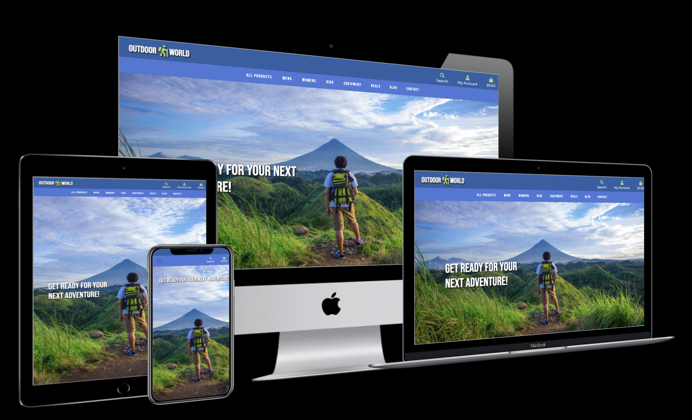

[CLICK HERE TO VISIT THE LIVE SITE](https://ts-outdoorworld.herokuapp.com/) 

----
 

# Table Of Content:

- <a href="#project_goals">Project Goals</a>
- <a href="#ux">User Experience (UX)</a>
    - <a href="#ux-user_stories">User Stories</a>
    - <a href="#ux-design">Design</a>
        - <a href="#ux-design-color">Color</a>
        - <a href="#ux-design-typography">Typography</a>
        - <a href="#ux-design-images">Images</a>
        - <a href="#ux-design-structure">Structure & Mockup Designs</a></a>
        - <a href="#ux-design-amendments">Amendments To Mockup Designs During Development</a></a>
- <a href="#features">Features</a>
    - <a href="#features-current">Current Features</a>
    - <a href="#features-future">Possible Future Features</a>
- <a href="#database">Database</a>
- <a href="#key-components">Key Components</a>
    - <a href="#key-components-languages">Languages</a>
    - <a href="#key-components-frameworks">Frameworks & Libraries</a>
    - <a href="#key-components-others">Others</a>
- <a href="#testing">Testing</a>
    - <a href="#testing-html">HTML</a>
    - <a href="#testing-css">CSS</a>
    - <a href="#testing-javascript">Javascript</a>
    - <a href="#testing-pep8">PEP8 Compliance</a>
    - <a href="#testing-lighthouse">Overall Website Performance & Compatibility </a>
    - <a href="#testing-responsive-design">Responsive Design</a>
    - <a href="#testing-browser-compatibility">Browser Compatibilty</a>
    - <a href="#testing-links">Link Testing</a>
    - <a href="#testing-email">Email Testing</a>
    - <a href="#testing-user-stories">User Story Testing</a>
    - <a href="#testing-problems-during-development">Problems During Development</a>
    - <a href="#testing-bugs">Known Bugs</a>
- <a href="#deployment">Deployment</a>
    - <a href="#deployment-heroku">Deployment With Heroku</a>
    - <a href="#deployment-forking">Forking</a>
    - <a href="#deployment-cloning">Cloning Project</a>
    - <a href="#database-setup">Database Setup</a>
- <a href="#credits">Credits</a>
    - <a href="#credits-content">Content</a>
    - <a href="#credits-media">Media</a>
    - <a href="#credits-code">Code</a>
    - <a href="#credits-acknowledgments">Acknowledgements</a>

----

# Project Goals

*   Design, develop and implement a full stack web application

*   Identify and apply necessary security features

*   Design a website that uses HTML, CSS, Javascript, Python & Django

# User Experience (UX)

    This section is designed to generate possible scenarios of the typical end user that would use this website. 
    This will help ensure end user requirements are designed into the website.

## <b>User Stories</b>

|ID|User Type|I want to be able to...|So that I can...|
|---|---|---|---|
|<strong>A. Viewing & Navigation</strong>|
|A1|All Users | See that they have landed on the correct site they intended to visit.| To reassure users they have arrived at the correct store.|
|A2|All Users | Understand the purpose and reason for the store.| To keep the interest of the users.|
|A3|All Users | Be able to view the website correctly on any device.|Browse the store fully without missing out on content or having a negative experience|
|A4|All Users | Find the business's social links| To engage with the business's social media pages and share the website with friends.|
|A5|Shopper | See all the products available| To find suitable products to purchase|
|A6|Shopper | Easily navigate categories of different products| To display a narrower selection of products they are interested in buying|
|A7|Shopper | See the value of the items in the basket| To see how much they have spent|
|A8|Shopper | Filter or See clearly any special offers that the site may have| To make savings on purchases|
|A9|Site User | Easily locate the login link.| Returning users are able to have access to their accounts without navigating multiple pages.|
|<strong>B. Registration & User Accounts</strong>|
|B1|Site User | Register for an account| To store information about purchases and addresses.|
|B2|Site User | Login/Logout of their account| Access account information and be able to logout to prevent other users viewing this information.|
|B3|Site User | See a list of previous orders made| To view previously purchased items|
|B4|Site User | Personal user account| To store address information|
|<strong>C. Purchasing & Checkout</strong>|
|C1|Shopper | Use a secure payment gateway| To make sure the transactions processed in the store are secure for both user and store.|
|<strong>D. Store Administration</strong>|
|D1|Store Administrator | Find administrator tools when logged in| To easily find the administrator tools section|
|D2|Store Administrator | To create, remove and update and delete products & blog posts.| To manage and update the store|
|D3|All Users | Administrator tools must only be visible to users with administrator privilidges| To make sure the store can only be managed by authorised personnel.|

## <b>Design</b>

* ### <b>Color</b>

    When choosing the most suitable color scheme for the site, I decided to list the main points of what I wanted to try to create from the design.

    Here are the key points to consider when choosing the colors:

        - Eye Catching
        - Comfortable
        - Color Compatibility
        - Use colors commonly associated with Adventure/Outdoor Activities

    I chose to develop both the logo and the main site theme at the same time to ensure that they could work well together. 
    The colors were going to be an important part of the design in order to create a brand that could be applied throughout the company should it be required in the future.

    To choose a compatible color scheme, I decided to use [Adobe Color](https://color.adobe.com/) to find colors that would work well together. 
    I began by searching the [Adobe Color](https://color.adobe.com/) site using keywords such as Outdoor, Mountains, Climing, Scrambling and Hiking. The site then found a large selection of different color schemes, and I chose a color scheme I felt would represent the brand for the site well.
    
    [Adobe Color](https://color.adobe.com/) also helps ensure that the colors are compatible together.

    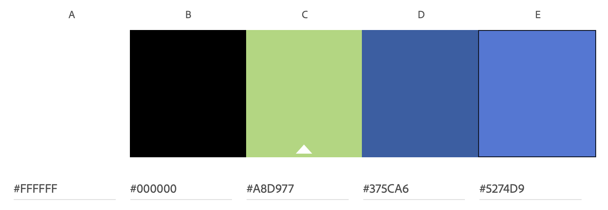

 

* ### <b>Typography</b>

    When choosing which font to use as part of my design, I felt it was important for it to be easy to read but less uniform than fonts commonly found on other sites. I wanted the font to be appropriate so that I could use it for the logo text and the main site text. This would then help maintain a nice continuity within the design and help create the store's brand.

    I have used Google to source the fonts and these are loaded within the head of the page.

    The logo font is [Bebas Neue](https://fonts.google.com/specimen/Bebas+Neue)

    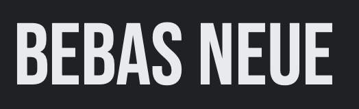

    The secondary font is [Montserrat](https://fonts.google.com/specimen/Montserrat)

    

    This font is used as the font for all key information of the product descriptions and checkout information etc. making sure the large blocks of text are easy to read.

* ### <b>Images</b>

    There is very little base images on the site, the majority of the images are the product images.
    The images for each of the products to the site are outsourced and the staff/administrator must provide a url to the image or they can use the image upload function that will store and reference the image from a remote storage solution by Amazon S3.

* ### <b>Structure & Mockup Designs</b>

    <h3>Homepage </h3>
    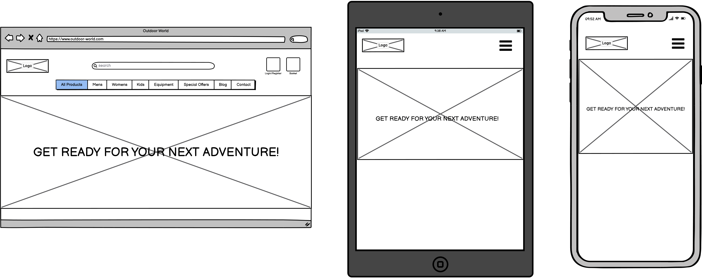

     
    <h3>Registration Page </h3>
    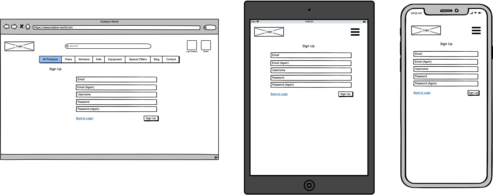

     
    <h3>Login Page </h3>
    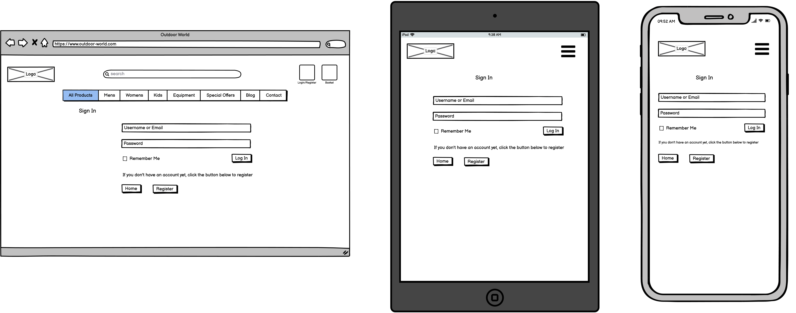

     
    <h3>Footer Template </h3>
    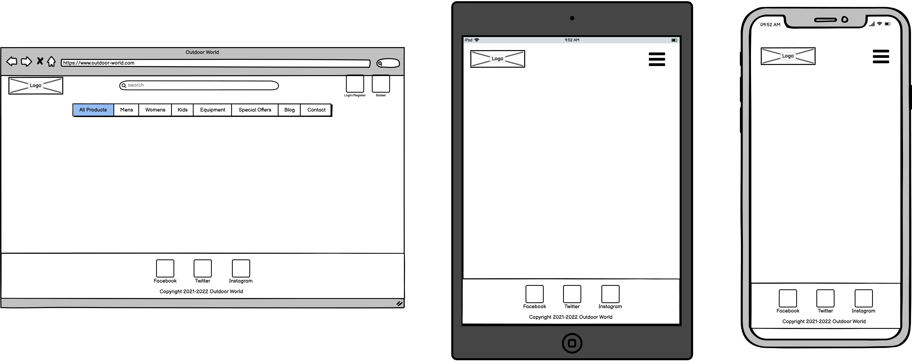

     
    <h3> Product Page </h3>
    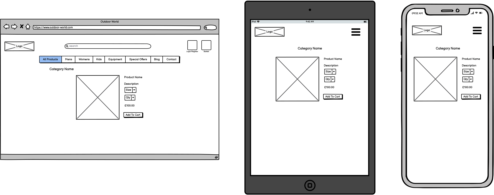

     
    <h3> Category Page </h3>
    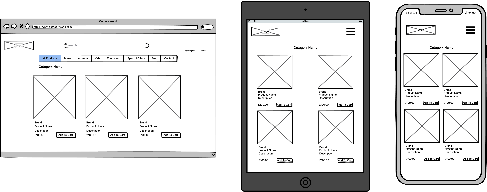

     
    <h3> Cart Page </h3>
    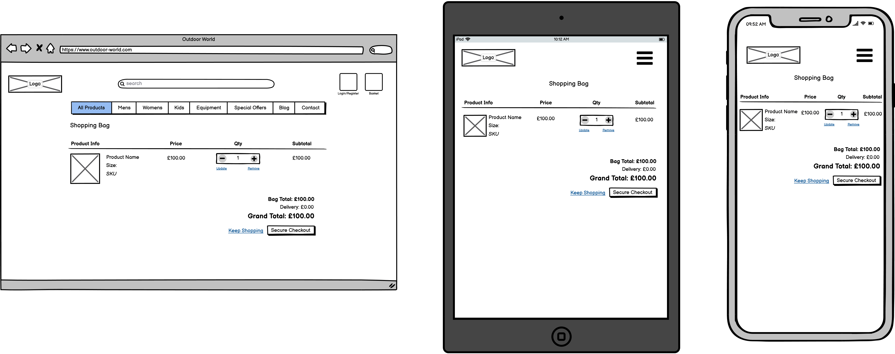

     
    <h3> Checkout Page </h3>
    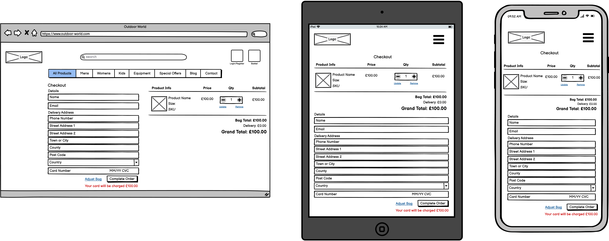

     
    <h3> Admin - Add Product Page </h3>
    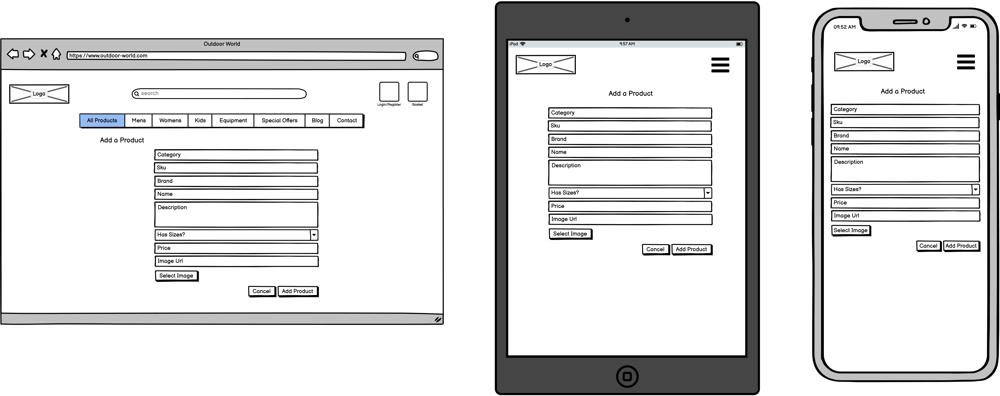

     
    <h3>Blog Page </h3>
    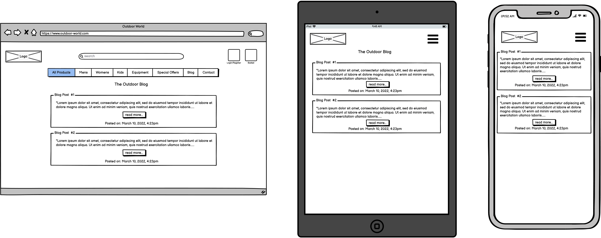

     
    <h3>Admin - Add Blog Page </h3>
    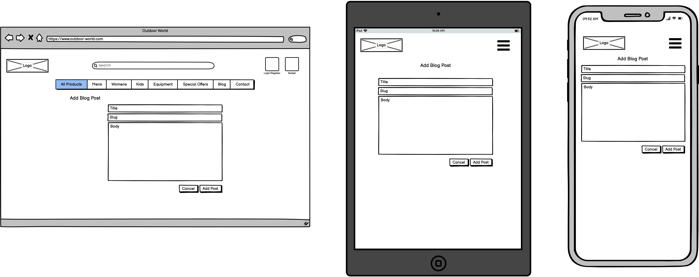

     
    <h3>Contact Page </h3>
    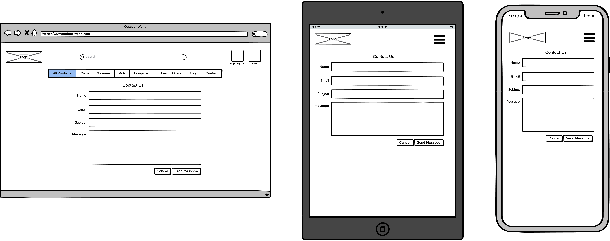

     
    <h3>User Access Structure </h3>
    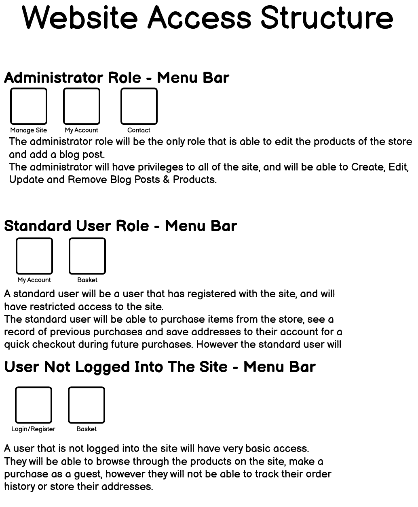
 

* ### <b>Amendments To Mockup Designs During Development</b>

    As the design was based on a common e-commerce template, there weren't many amendements during the development.
    Most changes that were made during the development were to margins and paddings to keep a nice clean layout for the store.
    Any future features that i'd like to implement into the store could change the original structure.

## <b>Features</b>

* ### <b>Current Features</b>

    * #### <b>User Access Structure</b>

        To help manage the store, there are 2 different roles that can be applied to registered users.
        A role for a customer that is restricted to only allow basic functions such as purchasing etc.
        A second role for a store administrator to be able to make product amendments to the store and create blog posts.

    * #### <b>Navigation Menu Based On User Level</b>

        <h3>Standard Navigation Menu</h3>
        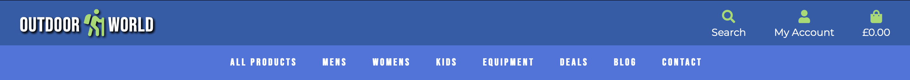

        <h3>Administrator Navigation Menu</h3>
        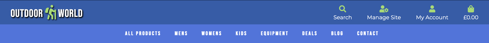

* ### <b>Possible Future Features</b>

    * #### Loyalty Scheme
        Returning customers can use their Outdoor World accounts to store and build loyalty points from regular purchases. These points could then be redeemed against money off vouchers. 

        This would be a good way for the store to retain and attract repeat business, in turn impoving sales.

    * #### Local Activity Section
        In order to offer the customers with opportunities to use the equipment they buy in the store. It would be good to offer adventures and tours that the store operates on the site. Customers could then register and pay for the courses online.

        This could create a good customer and business relationship, also helping to boost sales from any recommendations that instructors could make during the activities.

    * #### Hire Shop
        As the store is located within a watersport center, it would be great to manage all the equipment hires.
    
        Customers could be able to book and pay for the equipment online, the system would then generate an email with a unique code that the customer could present in-store to collect the hire equipment.

    * #### Product Reviews

        Customers could leave reviews for products they have purchased in the store.
        This can improve the shopping experience for others when browsing products and hopefully help promote sales for products receiving good reviews.

## <b>Database Diagram</b>

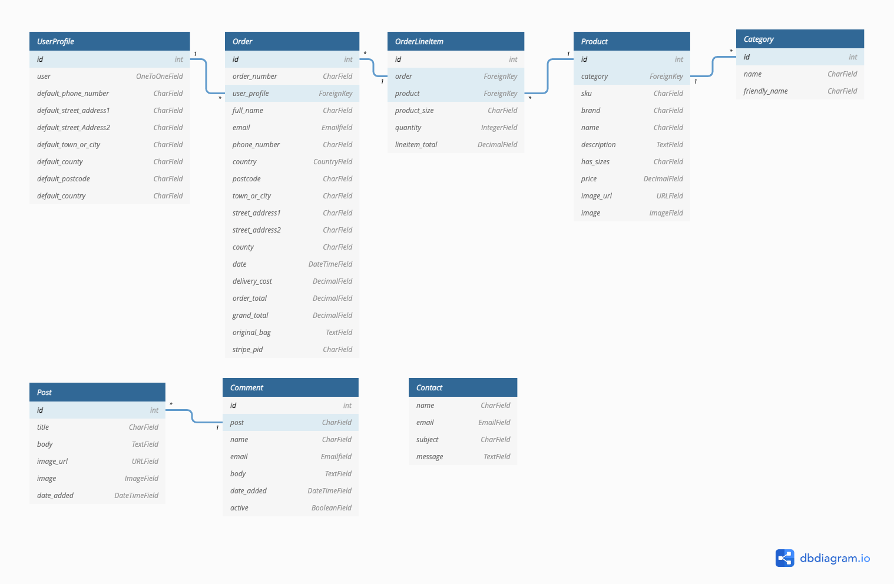

## <b>Key Components</b>

* ### <b>Languages</b>

    * #### [HTML5](https://en.wikipedia.org/wiki/HTML5)
    * #### [CSS3](https://en.wikipedia.org/wiki/CSS)
    * #### [JavaScript](https://www.javascript.com/)
    * #### [Python](https://www.python.org/)

* ### <b>Frameworks & Libraries</b>

    * #### [jQuery](https://jqueryui.com/)
    * #### [Jinja](https://jinja.palletsprojects.com/en/3.0.x/)
    * #### [FontAwesome](https://fontawesome.com/)
    * #### [Google Fonts](https://fonts.google.com/)

* ### <b>Others</b>

    * #### [GitHub](https://github.com/) - Repository Hosting
    * #### [GitPod](https://www.gitpod.io/) - Development Environment
    * #### [Adobe Illustrator](https://www.adobe.com/uk/products/illustrator.html) - Used to create the logo and favicon
    * #### [Website Mockup Generator](https://websitemockupgenerator.com/) - To create the opening image for the README.
    * #### [TinyPNG](https://tinypng.com/) - Used to reduce image file sizes
    * #### [Lighthouse](https://developers.google.com/web/tools/lighthouse) - Performance and Accessibility Reporting
    * #### [Balsamiq](https://balsamiq.com/) - Used to build the wireframes
    * #### [Heroku](https://www.heroku.com/) - Live site deployment
    * #### [Am I Responsive](http://ami.responsivedesign.is/) - To check responsive design
    * #### [W3 Validator](https://validator.w3.org/) - To check my HTML code

## <b>Testing</b>

* ### <b>HTML</b>

    To test my HTML code, I used the [W3 Validator](https://validator.w3.org/)

    Here is the pass report:

    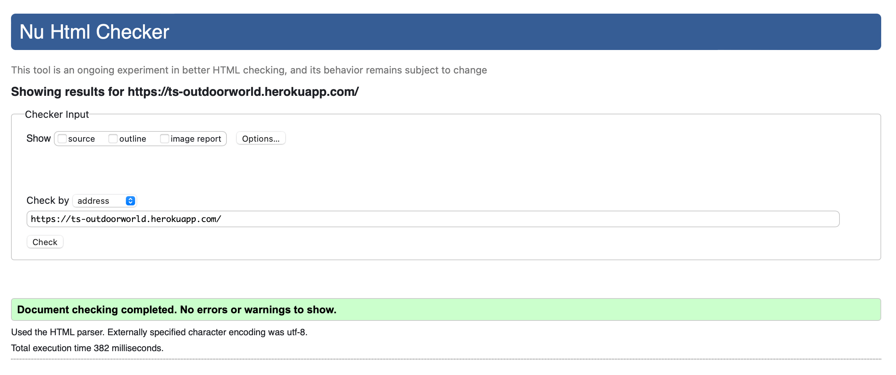

 

* ### <b>CSS</b>

    To test my CSS code, I used the [W3C CSS Validator](https://jigsaw.w3.org/css-validator/)

    Here is the report:

    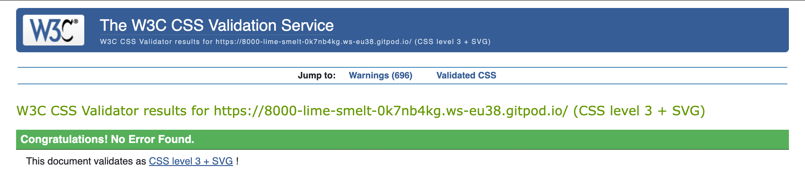

    

        

            
        

        

            
        

    

 

* ### <b>Javascript</b>

    To test my Javascript code, I used the [JSHint Validator](https://jshint.com/)

 

* ### <b>PEP8 Compliance</b>

    To test my PEP8 compliance, I used [PEP8 Online Check](http://pep8online.com).

 

* ### <b>Overall Website Performance & Compatibility</b>

    To test my websites performance and compatibility, I used [Lighthouse](https://developers.google.com/web/tools/lighthouse)

    Here is a screenshot of the report:

     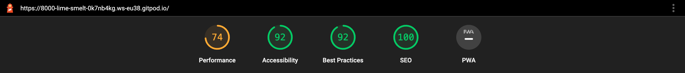

 

* ### <b>Responsive Design</b>

    In order to test the design on as many devices as possible, I came across a website called [Responsive Test Tool](http://responsivetesttool.com/)
    It enabled me to test my design on a large range of devices.

* ### <b>Browser Compatibility</b>

    To test my site's compatibility, I found a website called [Browserling](https://www.browserling.com/)

    Using this tool I was able to test a range of browsers, some of which I wouldn't otherwise have access to.
    Unfortunately the site has a limited free version, and an upgrade to a premium plan would be required to access every device they offer, however I'm confident that the site is very compatible on the most popular browsers.

    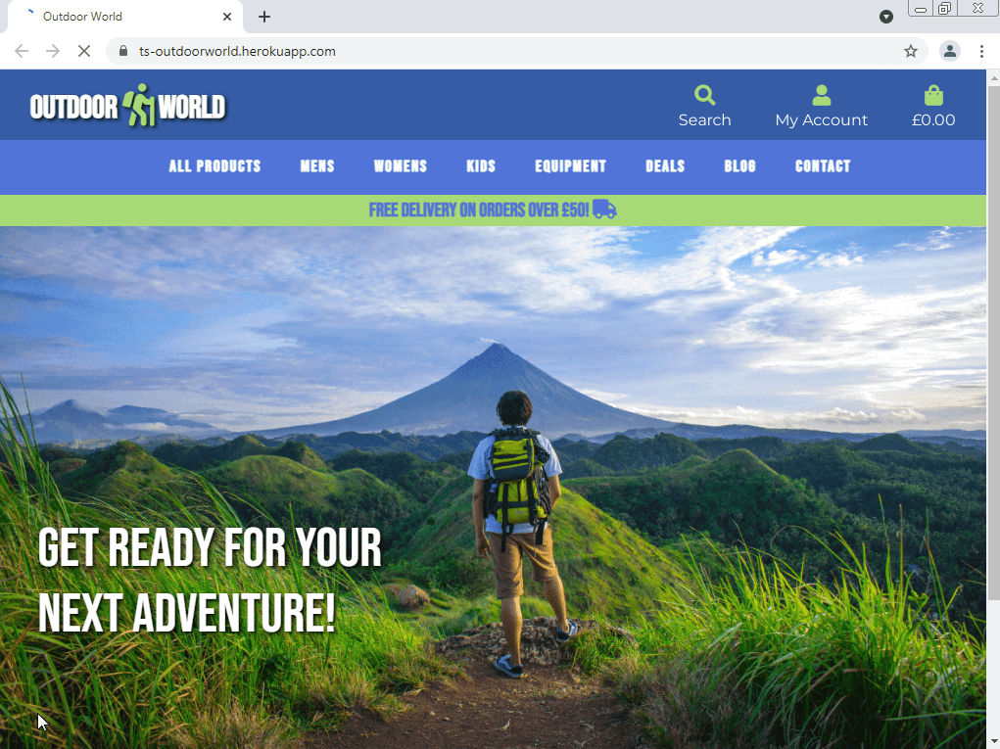
    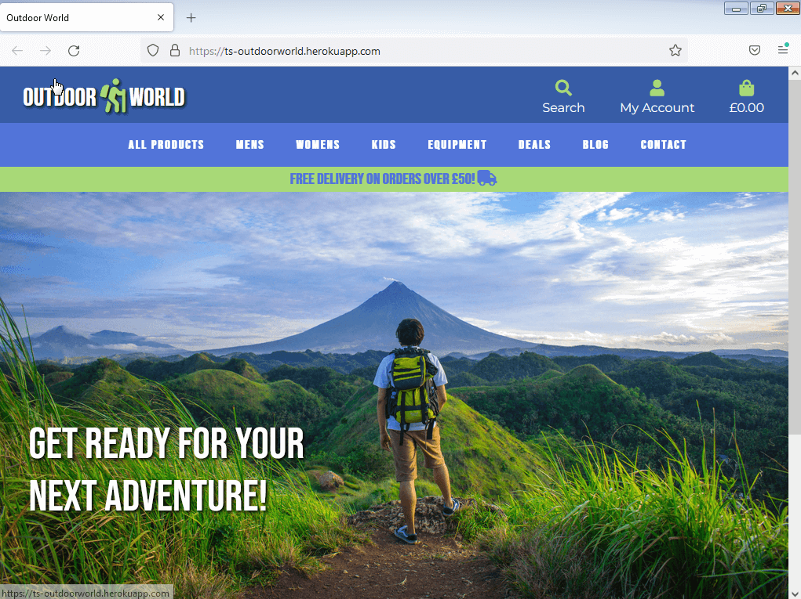
    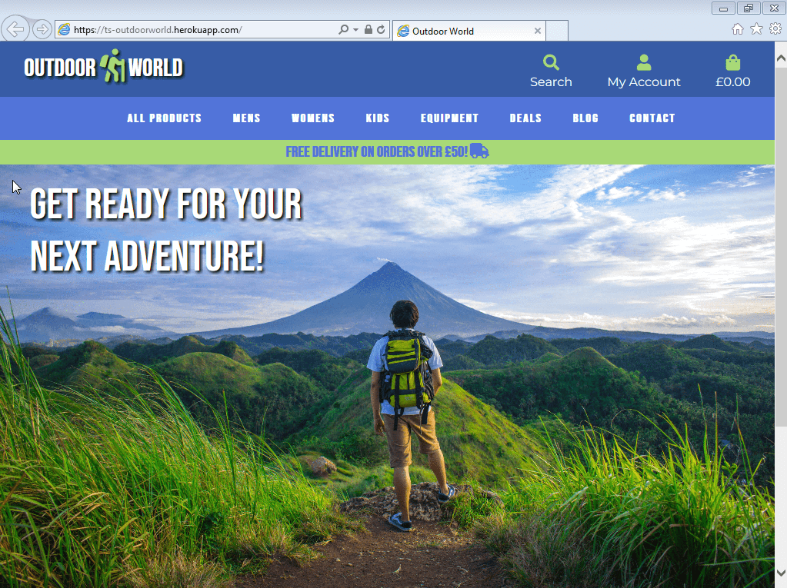
    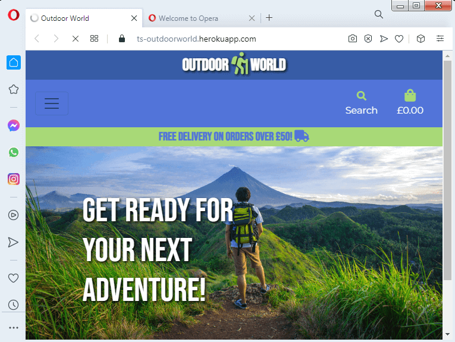

* ### <b>Link Testing</b>

     [Dead Link Checker](https://www.deadlinkchecker.com/)

    Here are the results from the [Dead Link Checker](https://www.deadlinkchecker.com/):

    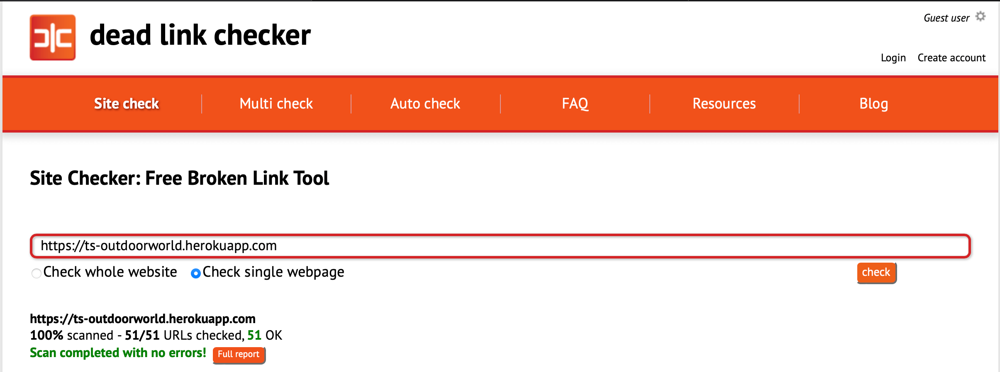

 

* ### <b>Email Testing</b>

    To test the store's emails, I went through the process of signing up to the account and purchasing an item as a customer would do. Here are the screenshots for the email the store submits to the user:

    Email sent to the customer to verify the registered account email address:
    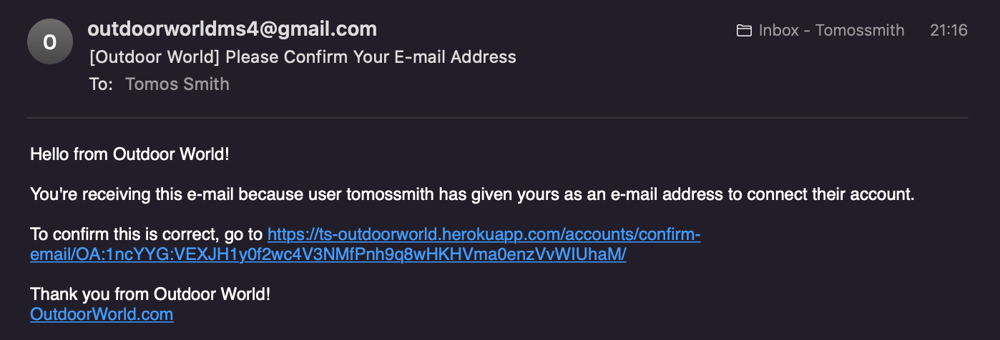

    Email sent to the customer to confirm the order:
    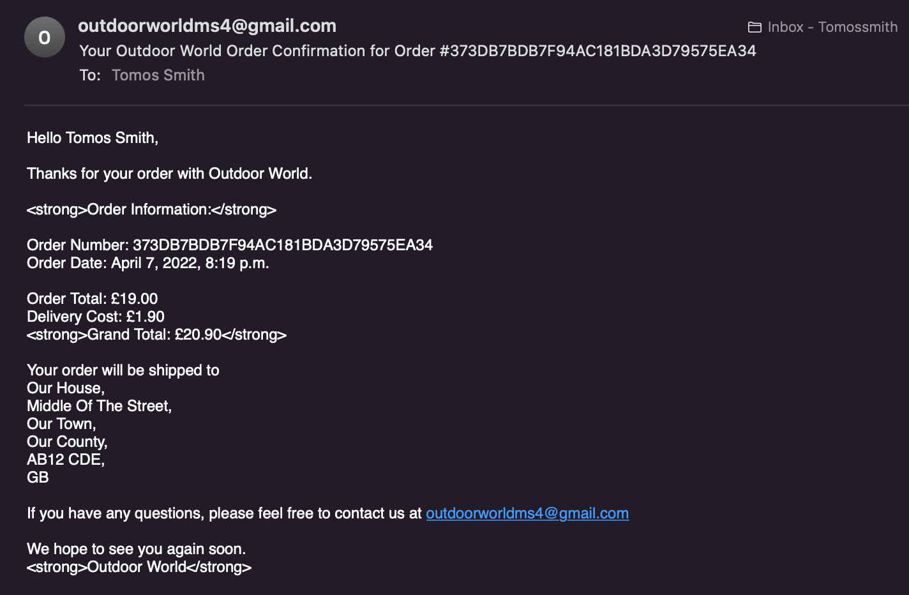

    Email sent to the store administration email address with the customer query.
    This email is sent using 'emailmessage' instead of 'sendmail' to submit the message with a 'reply-to' address. So when the administration team respond to the message, it automatically replies to the customers address.

    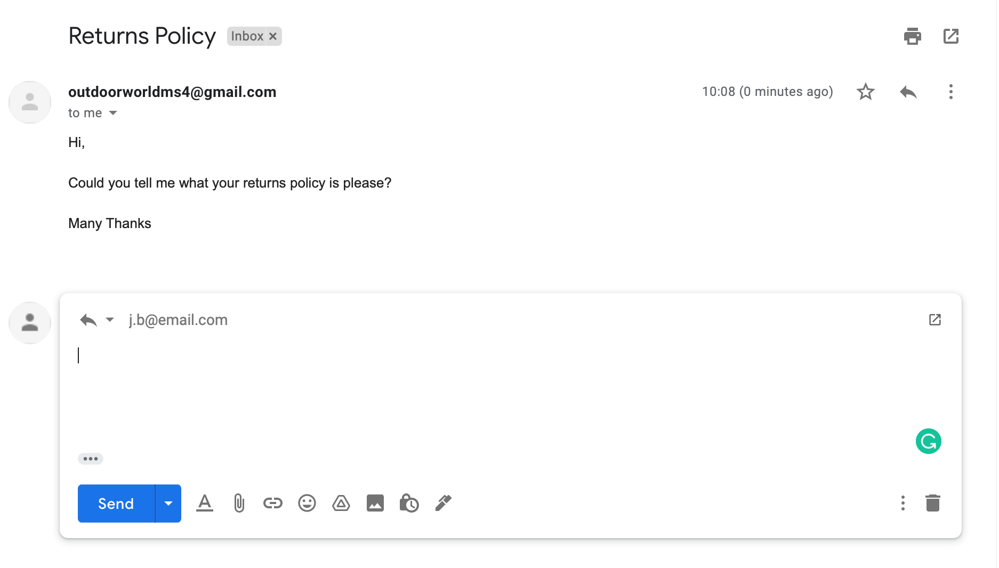

 

* ### <b>User Story Testing</b>

<b>A1:  See that they have landed on the correct site they intended to visit. </b>
        Once a user lands on the homepage, the logo is a strong element of the navigation bar at the top of the page. This remains in this position throughout of the site to inkeep with the store's branding.

<b>A2:  Understand the purpose and reason for the store.</b>
        The store follows a similar style to many of the e-commerce sites that users have become used to. When landing on the page, a spectacular scenic image fills the page to greet users.

<b>A3:  Be able to view the website correctly on any device.</b>
        As part of the website testing, I used [Responsive Test Tool](http://responsivetesttool.com/) to make sure the website would display well on a variety of devices.

<b>A4:  Find the business's social links</b>
        The store's social links are located at the footer of the website. I chose to have the links here as this is a common area that users expect to find any information relating to contacting the business.

<b>A5:  See all the products available</b>
        The products are displayed in a variety of ways by choosing the appropriate link on the navigation bar.
        To view all of the products sold in the store, customers can click 'all products'

<b>A6:  Easily navigate categories of different products</b>
        The products are listed into specific categories and each category is displayed within subcategories on the site's navigation bar.

<b>A7:  See the value of the items in the basket</b>
        The customer's basket is always visible at the header of the page.
        Each time a product is added to the basket, the total cost is updated and shown below the image of the basket.
        If the customer clicks on the basket, a dropdown will expand the display to show a list of all the products that are in the customer's basket.

<b>A8:  Filter or See clearly any special offers that the site may have</b>
        As part of the navigation bar, there is a specific tab to show any special offers that the store has.
        Within this dropdown is a breakdown of the different types of offers available.

<b>A9:  Easily locate the login link.</b>
        As the store login and registration links are important part of the user interaction with the site, I made sure to include the login/registration link within the main navigation bar for the page. 
        Users can find the link at the top of the page with an icon that corresponds to what the user would expect to relate to logging into their account.

<b>B1:  Register for an account</b>
        To improve user interaction and to manage repeat purchases, the store has the facility for users to register for an account during the checkout process or by following a link on the homepage.
        Registering for an account will give the customers some additional features on the site.

<b>B2:  Login/Logout of their account</b>
        Registered users of the store are able to login and logout of their accounts using the link at the top of every page.

<b>B3:  See a list of previous orders made</b>
        When users login to the store with their accounts, the links in the navigation menu change to reflect the additional options that users that are logged in have access to.
        A 'my account' link will display and when clicked, a dropdown will provide the user with options to view their accounts or logout. Clicking 'my account' will navigate the user to a page that has the option to update their default delivery addresses or view a list of any previous orders they have made.

<b>B4:  Personal user account</b>
        As part of the user account, users are able to store and update their default delivery address.
        The option to store the address is given to the user during checkout, then they are able to update the address within the my account section.

<b>C1:  Use a secure payment gateway</b>
        It is critical that customers are confident that their payment information is processed securely and to achieve this I chose to use [Stripe](https://stripe.com/) to process the website payments.
        Stripe is a secure payment processing platform that is trusted by global banks.

<b>D1:  Find administrator tools when logged in</b>
        When an administrator signs into the store, the navigation bar at the top of the page will display an additional link to manage the store. This link will only be available to users that are set as superusers.

<b>D2:  To create, remove and update and delete products & blog posts.</b>
        Store administrators are able to add products and posts by clicking the 'manage site' link that is displayed in the navigation bar when they log in, followed by choosing 'add blog post' or 'add product'
        To edit or delete products and posts, administrators can click on the icons on a product page or blog post.

<b>D3:  Administrator tools must only be visible to users with administrator privilidges</b>
        To prevent users not authorised to make changes to the site, there are additional lines of code written at several stages to prevent unauthorised access.
        In the navigation bar, the following code will make sure that the 'manage site' link is only displayed to superusers:

            
                <a href="" class="dropdown-item">Product Management</a>
            

        The same IF statements are used on the product and blog pages to display additional icons that allow the user to edit or delete the selected product or blog post.
        
 

* ### <b>Problems During Development</b>

- When a user uploaded an image using a URL, the front end image would always appear as a broken image.
I belive this was because it was trying to refer to a generated URL that is created for an image that is uploaded.

To correct this issue, I created an ELIF statement within the IF function that was already written. 
The function would then check if an image had been uploaded, if not then check for a image URL and if neither had been uploaded then it would place a generic 'no image' placeholder for the project.

- I was receiving the following error everytime I was trying to edit a blog post:

"django.urls.exceptions.NoReverseMatch: Reverse for 'edit_product' with arguments '('',)' not found. 1 pattern(s) tried: ['products/edit/"  

After reading through my code in detail, I noticed I had forgotten to include the post.id within the form action.

 

* ### <b>Known Bugs</b>

At the time of writing this README, I am not aware of any bugs.

 

## <b>Deployment</b>

In order to deploy the project, you will need the following:

    - Github Account
    - Heroku Account
    - Gitpod or similar IDE
    - Python3
    - Stripe Account
    - Amazon Web Services Account
    - An Email Account
   
* ### <b>Forking</b>

    To fork this repository, you will need to carry out the following steps;

    - On [Github](https://www.github.com), navigate to the repository you wish to fork.

    - In the top right corner click <b>Fork</b>

* ### <b>Cloning Project</b>

    In order to display the website with all its features, you will need to clone the repository to your GitHub account or locally. 

    Cloning will enable you to copy all of the site's files at that time, into your own working environment to apply any changes or test the site.

    - On GitHub, navigate to the repository location
    - On the right hand side of the page you will see a green button labelled 'Code'. Click This
    - A menu will appear with different ways of cloning the repository.

    <b>To Clone the repository By HTTPS</b>
    - From the previous step, click on the clipboard button (located after the address) under the 'HTTPS' tab.
    - Open terminal and change directory to the area you wish to load the repository into.
    - Once you're in the required directory, enter the command 'git clone' and paste the URL that you added to the clipboard in the previous step. - Press Enter

    <b>To Clone the repository to GitHub Desktop</b>
    - Follow steps 1,2 and 3 above.
    - Click 'Open with GitHub Desktop
    - Follow the prompts within the GitHub Desktop popups to complete the clone.

    <b>How to download a Zip file of the repository</b>
    - Follow steps 1,2 and 3 above.
    - Select the option 'Download Zip'

    Once you have cloned the repository, you will need to carry out these additional steps:

    - Install the requirements into your workspace, type the following in the command interface:

        'pip3 install -r requirements.txt'

    <b>Setup the enviroment variables:</b>
        * Create a .gitignore file in the root directory of the project.
        * Create an env.py file and list the following variables in the file:

            import os
            os.environ("DATABASE_URL": "<your database URL>")
            os.environ("EMAIL_HOST_PASS": "<your individual key>")
            os.environ("EMAIL_HOST_USER": "<your individual email address>")
            os.environ("SECRET_KEY": "<your individual secret key>")
            os.environ("STRIPE_PUBLIC_KEY": "<your individual stripe public key>")
            os.environ("STRIPE_SECRET_KEY": "<your individual stripe secret key>")
            os.environ("STRIPE_WH_SECRET": "<your individual stripe webhook secret key>")

        <b>IMPORTANT - remember to add your env.py file to .gitignore</b>

    <b>Create the database:</b>
        * Run the command 'python3 manage.py makemigrations'
        * Run the command 'python3 manage.py migrate'
    
    <b>Create a superuser:</b>
        * Run the command 'python3 manage.py createsuperuser' and follow the instructions.

    <b>Test the app</b>
        * Run the command 'python3 manage.py runserver'

* ### <b>Deployment With Heroku</b>

    <b>To deploy to Heroku, you will need to:</b>

    - Navigate to the Heroku website and login or signup for an account.
        - Click 'New' to create a new app and complete the location and application information.

    - Once completed, enter the following in your CLI:
        - 'pip3 install dj_database_url'
        - 'pip3 install psycopg2-binary'
        - 'pip3 freeze > requirements.txt'
        - 'heroku login -i' and follow the instructions to login
        - Migrate the database to postgres with the command:
            'heroku run python manage.py migrate'
        - Install gunicorn with the command 'pip3 install gunicorn'
        - Create a new file called Procfile and include the following in the document:

        web: gunicorn <your-application-name>.wsgi:application

        - In your settings.py file, set the allowed hosts by including:

        ALLOWED_HOSTS = ['<application-name>.herokuapp.com', 'localhost']

    - Once these steps are complete, return to HEROKU and carry out the following:
        - Select the 'Deploy' tab and choose 'Github' under the deployment method.
        - Connect to your Github and enter the repository details.
        - In the 'settings' tab, find 'Convig Vars' and select 'Reveal Config Vars' and enter the following config variables with your own values:

        |KEY|VALUE|
        |DATABASE_URL|<your postgres database url>|
        |EMAIL_HOST_PASS|<your email password>|
        |EMAIL_HOST_USER|<your email account address>|
        |SECRET_KEY|<your secret key>|
        |STRIPE_PUBLIC_KEY|<your stripe public key>|
        |STRIPE_SECRET_KEY|<your stripe secret key>|
        |STRIPE_WH_SECRET|<your stripe webhook secret key>|
        |AWS_ACCESS_KEY_ID|<your aws access key>|
        |AWS_SECRET_ACCESS_KEY|<your aws secret access key>|
        |USE_AWS|True|

* ### <b>Database Setup</b>

    -   To setup the store database, you will need to do the following:
        -   In your settings.py file under the default database section, include the following:

            DATABASES = {'default'dj_database_url.parse(<Enter the DATABASE_URL>)}
        
        - Create the databases by migrating the models:
            'python3 manage.py makemigrations'
            'python3 managepy migrate'
        - Load the categories and products in order due to the dependencies:
            'python3 manage.py loaddata categories'
            'python3 manage.py loaddata products'
        - Create a superuser:
            'python3 manage.py createsuperuser'

        - Once you have carried aout the above settings, remove the DATABASE_URL from the settings.py file and set the previous default database settings.

        - Push your code to Github

## <b>Credits</b>

* ### <b>Content</b>

    * Item descriptions were taken directly from the manufacturers sites..

* ### <b>Media</b>

    *   Product Images were all taken from the manufacturers websites.

    *   No Image Icon - <a href="https://www.freeiconspng.com/img/23494">No Save Icon Format</a>

    *   Homepage Hero - <a href="https://www.pexels.com/photo/man-wearing-white-shirt-brown-shorts-and-green-backpack-standing-on-hill-672358/">Homepage Hero Image</a>

* ### <b>Code</b>

    * Bulma - /* from Bulma - Maintains FontAwesome icon sizes and centering */

* ### <b>Acknowledgements</b>

    - Thank you to everyone on Slack for help and advice
    - Thanks to all the tutors who have supported me during the project.
    - Thanks to Code Intitute for the walk through project which I used and referenced during the development.
    - Thank you to my mentor [Caleb Mbakwe](https://www.linkedin.com/in/calebmbakwe/) for his great guidance